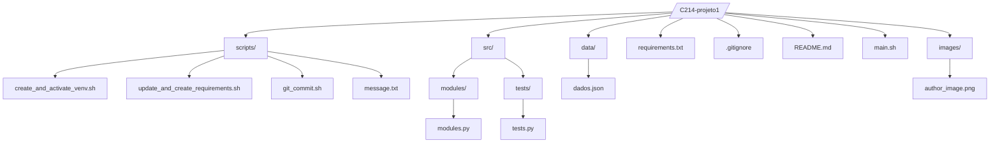

# C214 - Project 1

Repository dedicated to the first project of the discipline **C214 - Object-Oriented Software Development** at **INATEL**. The project consists of a modularized Python application that includes automation scripts and organized code.

## Overview

The main objective of this project is to create a Python application using good software development practices, such as code modularization, virtual environment setup, and automation scripts to simplify the workflow. The application allows for data manipulation from a JSON file, unit testing, and the use of auxiliary scripts to automate recurring tasks such as creating virtual environments and Git commits.

## Folder Structure

The project folder structure is organized as follows:



## Folder Explanation

- **scripts/**: Contains utility scripts that automate recurring tasks, such as creating a virtual environment `create_and_activate_venv.sh`, updating and creating the `requirements.txt` file `update_and_create_requirements.sh`, and scripts for Git commits `git_commit.sh`.

- **src/**: Main source code folder. Contains the project modules and tests:

- **modules/**: Contains the main application modules `modules.py`.
    - **tests/**: Contains unit tests and mocks related to the project `tests.py`.
    - **data/**: Contains data files, such as a JSON file `dados.json` used by the project.

- **requirements.txt**: List of dependencies required to run the project.

- **.gitignore**: Configuration file to ignore unwanted files and folders in Git.

- **README.md**: Project documentation file.

- **main.sh**: Main file that starts the tests.


## How to Run the Project

### Creating and Activating the Virtual Environment

To ensure an isolated environment for the project, you need to create a virtual environment. There are two ways to create and activate the virtual environment:

#### Traditional Method

1. Create a virtual environment using the command:
    ```bash
    python -m venv C214venv
    ```

2. Activate the virtual environment:
- Windows:
    ```bash
    .\venv\Scripts\activate
    ```

- Linux or macOS:
    ```bash
    source venv/bin/activate
    ```

#### Using the Available Script

1. Use the `create_and_activate_venv.sh` script to automate the creation and activation of the virtual environment:

    ```bash
    ./scripts/create_and_activate_venv.sh
    ```

### Installing Dependencies

Once the virtual environment is activated, install the necessary dependencies by running the command:

```bash
pip install -r requirements.txt
```

## Authors


*Tico(Matheus) e Teco(Álvaro) - Aspirantes a Testers nesse projeto, se foi feito certo, só o Chris para decidir.*
