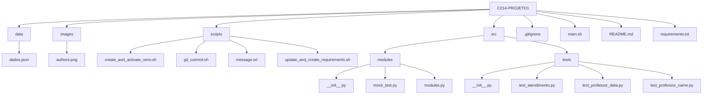

# C214 - Project 1

Repository dedicated to the first project of the discipline **C214 - Software Engineering** at **INATEL**. The project consists of a modularized Python application that includes automation scripts and organized code.

## Overview

The main objective of this project is to create a Python application using good software development practices, such as code modularization, virtual environment setup, and automation scripts to simplify the workflow. The application allows for data manipulation from a JSON file, unit testing, and the use of auxiliary scripts to automate recurring tasks such as creating virtual environments and Git commits.

## Folder Structure

The project folder structure is organized as follows:



## Folder Explanation

- **scripts/**: Contains utility scripts that automate recurring tasks:
  - **create_and_activate_venv.sh**: Creates and activates a Python virtual environment. This script installs all necessary dependencies for the development environment, ensuring that libraries are not installed globally, which helps avoid version conflicts.
  - **update_and_create_requirements.sh**: Automates the process of updating and creating the `requirements.txt` file, which lists all project dependencies. It ensures that `requirements.txt` is always up-to-date with the libraries installed in the virtual environment.
  - **git_commit.sh**: Facilitates the Git commit process by allowing the user to set a commit message in a file (`message.txt`) and executing the `git commit` command automatically with that message. This streamlines the Git workflow.

- **src/**: Main source code folder. Contains the project modules and tests:
  - **modules/**: Contains the main application modules:
    - **modules.py**: This file contains the core modules of the application. It implements the main functionalities of the project used by other parts of the code.
    - **mock_test.py**: A test module that contains mocks used in unit tests. It simulates the behavior of functions or classes in a controlled manner to test parts of the code in isolation.
  - **tests/**: Contains unit tests and mocks related to the project:
    - **test_atendimento.py**, **test_professor_data.py**, **test_professor_name.py**: Unit test files for different parts of the project. They verify that the methods and functionalities of the project are working as expected, helping ensure code stability.

- **data/**: Contains data files:
  - **dados.json**: A JSON file used by the project for data input.

- **requirements.txt**: List of dependencies required to run the project.

- **.gitignore**: Configuration file to ignore unwanted files and folders in Git.

- **README.md**: Project documentation file.

- **main.sh**: A Bash script that serves as the entry point for running tests. It can be configured to execute all tests defined in the files within the `tests` folder.

## How to Run the Project

### Creating and Activating the Virtual Environment

To ensure an isolated environment for the project, you need to create a virtual environment. There are two ways to create and activate the virtual environment:

#### Traditional Method

1. Create a virtual environment using the command:
    ```bash
    python -m venv C214venv
    ```

2. Activate the virtual environment:
- Windows:
    ```bash
    .\venv\Scripts\activate
    ```

- Linux or macOS:
    ```bash
    source venv/bin/activate
    ```

#### Using the Available Script

1. Use the `create_and_activate_venv.sh` script to automate the creation and activation of the virtual environment:

    ```bash
    ./scripts/create_and_activate_venv.sh
    ```

### Installing Dependencies

Once the virtual environment is activated, install the necessary dependencies by running the command:

```bash
pip install -r requirements.txt
```

### Running the Tests

#### Running Tests via Terminal

To run the tests directly from the terminal, use the following command:

```bash
python -m unittest discover -s src/tests
```

#### Running Tests Using the Provided Script

To run the tests using a script, you can use the following command:

```bash
./main.sh
```

## Authors


*Tico (Matheus) and Teco (Álvaro) - Aspiring testers in this project. Whether it was done correctly is up to Chris to decide.*